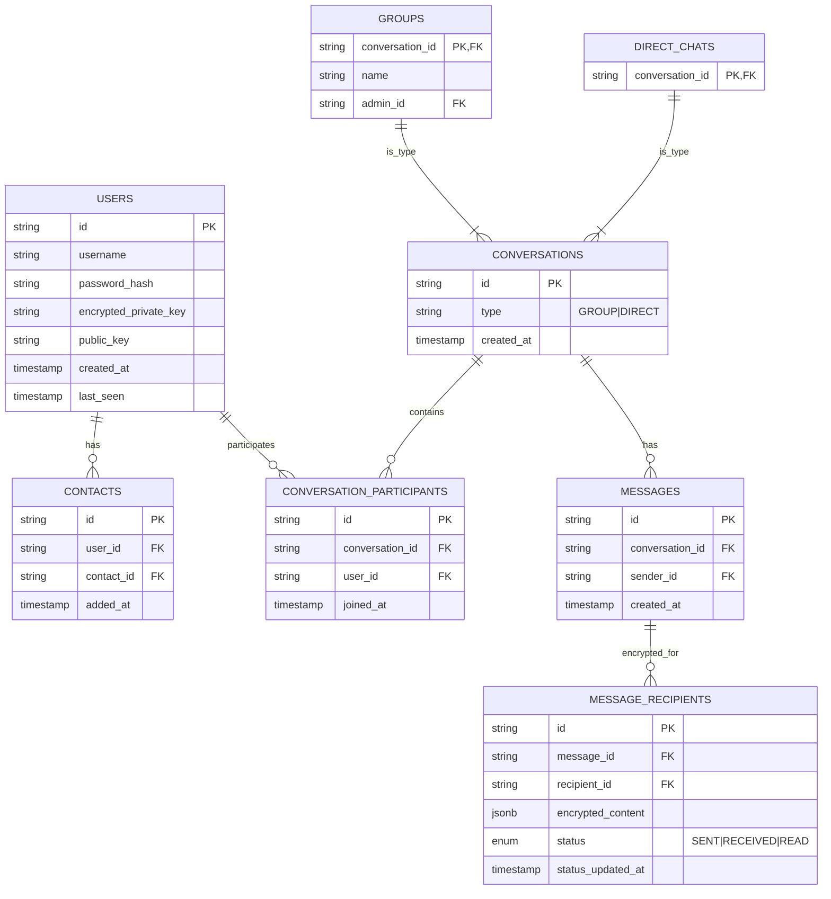
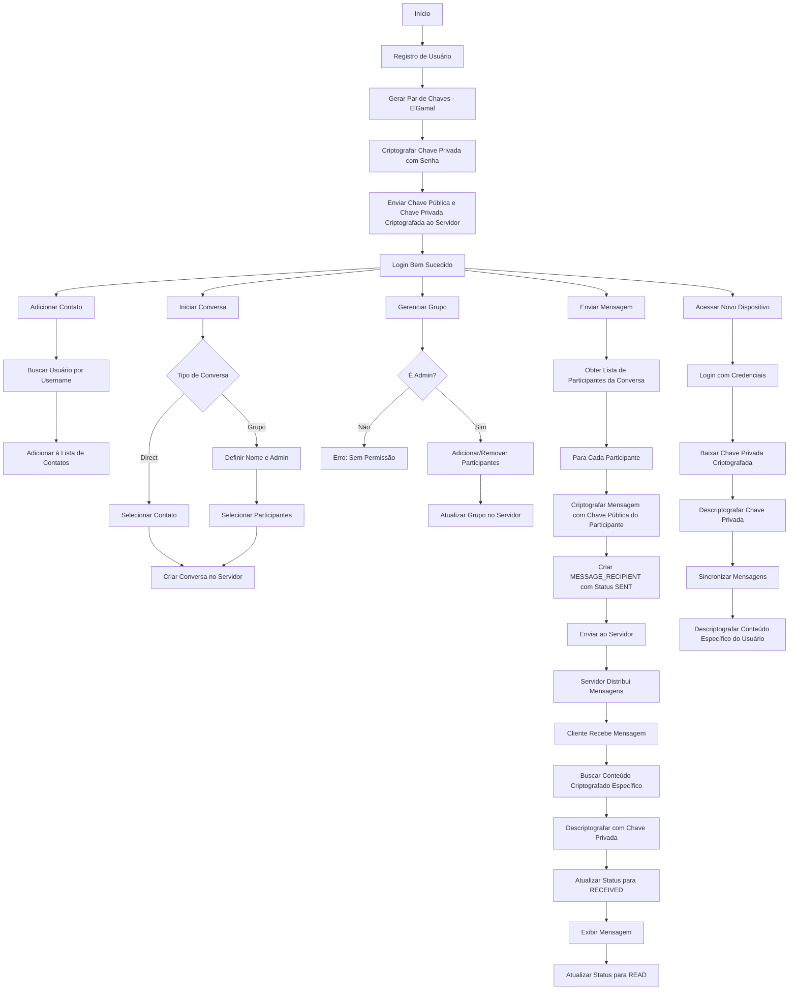

# Chat E2EE

## Visão Geral

O **Chat E2EE** é uma aplicação de mensagens com criptografia de ponta a ponta que prioriza a privacidade e segurança dos usuários. A aplicação utiliza criptografia ElGamal para garantir que apenas os usuários envolvidos nas conversas possam acessar o conteúdo das mensagens.


## Arquitetura

### Diagrama de Entidade Relacionamento


### Fluxo de Criptografia e Operações


### Componentes Principais

#### Frontend (React + TypeScript)
- Interface do usuário
- Gerenciamento de chaves e criptografia
- Comunicação via WebSocket

#### Backend (Go + Gin)
- Roteamento de mensagens criptografadas
- Gerenciamento de sessões e dispositivos
- Autenticação de usuários

#### Banco de Dados (SQLite)
- Armazenamento de mensagens e conteúdos criptografados
- Chaves públicas dos usuários
- Chaves privadas criptografadas
- Metadados de conversas e grupos

### Segurança

1. **Chaves e Autenticação**
   - **Chaves Privadas:** Armazenadas no servidor de forma criptografada, protegidas pela senha do usuário
   - **Chaves Públicas:** Disponíveis no servidor para facilitar a criptografia das mensagens
   - **Autenticação:** Baseada em tokens JWT com expiração configurável

2. **Criptografia de Mensagens**
   - **Processo de Criptografia:**
     1. Para cada mensagem enviada, o sistema identifica todos os participantes da conversa
     2. O conteúdo é criptografado individualmente com a chave pública de cada participante
     3. Cada versão criptografada é armazenada como um MESSAGE_RECIPIENT separado
   - **Algoritmo:** ElGamal para criptografia assimétrica
   - **Integridade:** Assinatura digital do remetente em cada mensagem

3. **Gestão de Conversas**
   - **Chats Diretos:**
     - Conversas entre dois participantes
     - Mensagens criptografadas individualmente para cada participante
   - **Grupos:**
     - Suporte a múltiplos participantes
     - Gerenciamento de permissões através de admin
     - Mesmo processo de criptografia dos chats diretos, escalando para todos os membros

4. **Status de Mensagens**
   - **SENT:** Mensagem criptografada e armazenada no servidor
   - **RECEIVED:** Destinatário recebeu e descriptografou a mensagem
   - **READ:** Destinatário visualizou a mensagem
   - Status rastreado individualmente para cada destinatário

5. **Multi-dispositivo**
   - **Login:** Autenticação com credenciais em novo dispositivo
   - **Recuperação de Chaves:** Descriptografia da chave privada usando senha do usuário
   - **Sincronização:** Acesso a todas as mensagens criptografadas específicas para o usuário
   - **Consistência:** Atualização de status sincronizada entre dispositivos

6. **Proteção Contra Ataques**
   - **Man-in-the-Middle:** Criptografia individual previne interceptação de mensagens
   - **Replay:** Timestamps e identificadores únicos previnem reenvio de mensagens
   - **Força Bruta:** Chaves ElGamal de alta segurança
   - **Comprometimento de Servidor:** Conteúdo sempre criptografado, servidor não tem acesso às mensagens

7. **Backup e Recuperação**
   - **Chaves:** Backup seguro da chave privada criptografada
   - **Mensagens:** Preservação do histórico criptografado
   - **Recuperação:** Possível em novos dispositivos após autenticação

8. **Privacidade**
   - **Metadados Mínimos:** Apenas informações essenciais armazenadas
   - **Criptografia Individual:** Garante que apenas destinatários específicos acessem o conteúdo
   - **Controle de Acesso:** Gerenciamento granular de participantes em grupos

9. **Escalabilidade**
   - **Grupos:** Suporte eficiente para grandes números de participantes
   - **Armazenamento:** Otimização do espaço através de limpeza periódica de mensagens antigas
   - **Performance:** Criptografia assíncrona para melhor desempenho
   
## Instalação

### Pré-requisitos
- Go 1.16+
- Node.js e npm
- SQLite

### Backend
```bash
git clone https://github.com/gugarauj07/chat-e2ee.git
cd chat-e2ee/server
go mod tidy
go run main.go
```

### Frontend
```bash
cd ../frontend
npm install
npm start
```

## Licença

MIT License - veja o arquivo [LICENSE](LICENSE) para detalhes.
