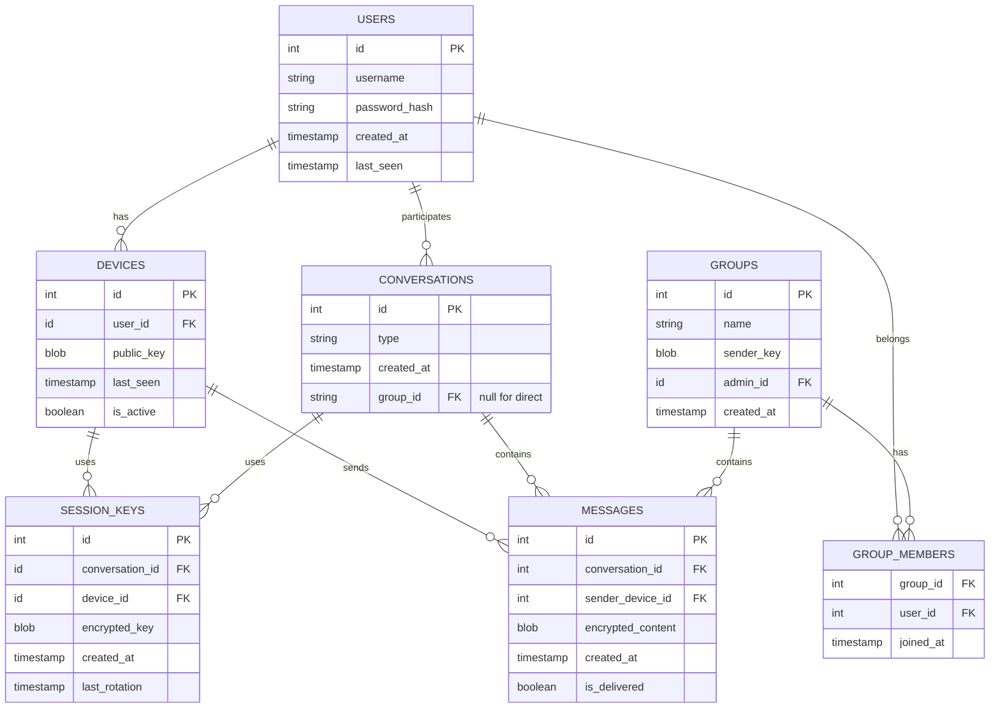
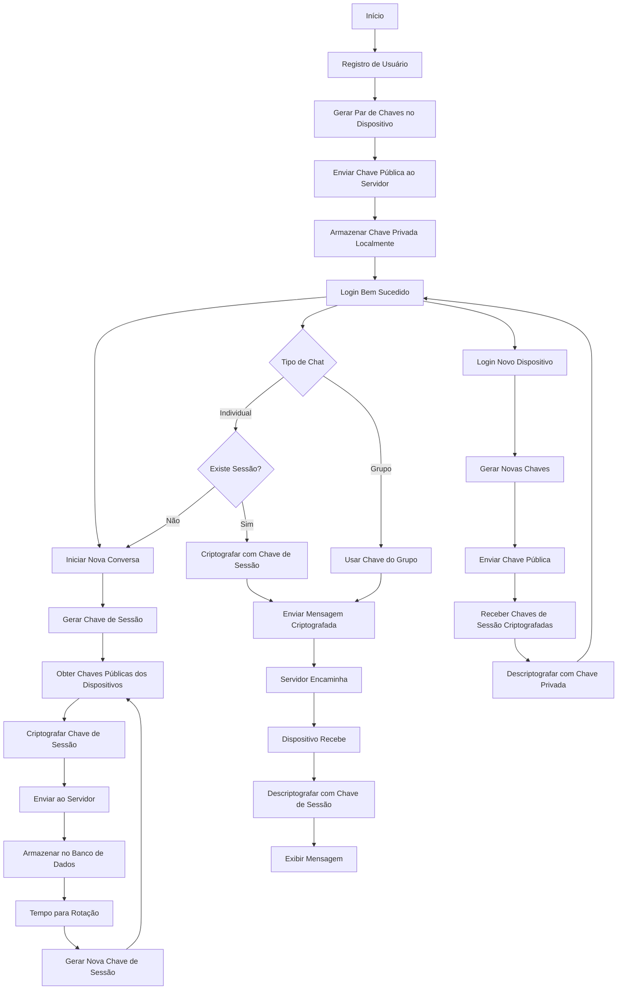

# Chat E2EE

## Visão Geral

O **Chat E2EE** é uma aplicação de mensagens com criptografia de ponta a ponta que prioriza a privacidade e segurança dos usuários.

## Arquitetura

### Diagrama de Entidade Relacionamento


### Fluxo de Criptografia


### Componentes Principais

#### Frontend (React + TypeScript)
- Interface do usuário
- Gerenciamento de chaves e criptografia
- Comunicação via WebSocket

#### Backend (Go + Gin)
- Roteamento de mensagens criptografadas
- Gerenciamento de sessões e dispositivos
- Autenticação de usuários

#### Banco de Dados (SQLite)
- Armazenamento de mensagens criptografadas
- Chaves públicas dos dispositivos
- Chaves de sessão criptografadas
- Metadados de conversas e grupos

### Segurança

1. **Chaves e Sessões**
   - Chaves privadas permanecem apenas nos dispositivos
   - Chaves de sessão criptografadas para cada dispositivo
   - Sender keys para grupos
   - Chaves de sessão armazenadas de forma segura no banco

2. **Rotação de Chaves**
   - Iniciada pelo cliente
   - Nova chave distribuída para todos os dispositivos
   - Histórico de rotações mantido para auditoria

3. **Múltiplos Dispositivos**
   - Cada dispositivo tem seu próprio par de chaves
   - Chaves de sessão específicas por dispositivo
   - Gerenciamento independente de sessões

### Estrutura do Banco

1. **Users e Devices**
   - Usuários podem ter múltiplos dispositivos
   - Cada dispositivo tem sua chave pública
   - Rastreamento de status online/offline

2. **Conversas e Mensagens**
   - Suporte a conversas individuais e grupos
   - Mensagens sempre criptografadas
   - Status de entrega rastreado

3. **Chaves de Sessão**
   - Armazenadas criptografadas por dispositivo
   - Vinculadas a conversas específicas
   - Sistema de rotação automática

## Instalação

### Pré-requisitos
- Go 1.16+
- Node.js e npm
- SQLite

### Backend
```bash
git clone https://github.com/seu-usuario/chat-e2ee.git
cd chat-e2ee/server
go mod tidy
go run main.go
```

### Frontend
```bash
cd ../frontend
npm install
npm start
```

## Licença

MIT License - veja o arquivo [LICENSE](LICENSE) para detalhes.
