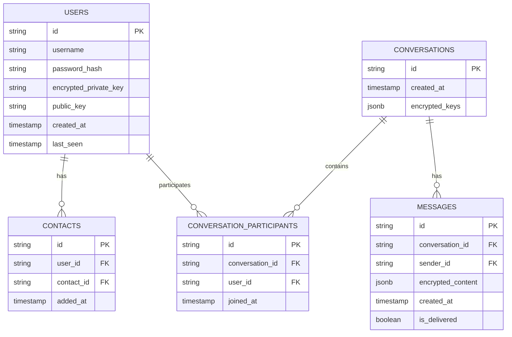
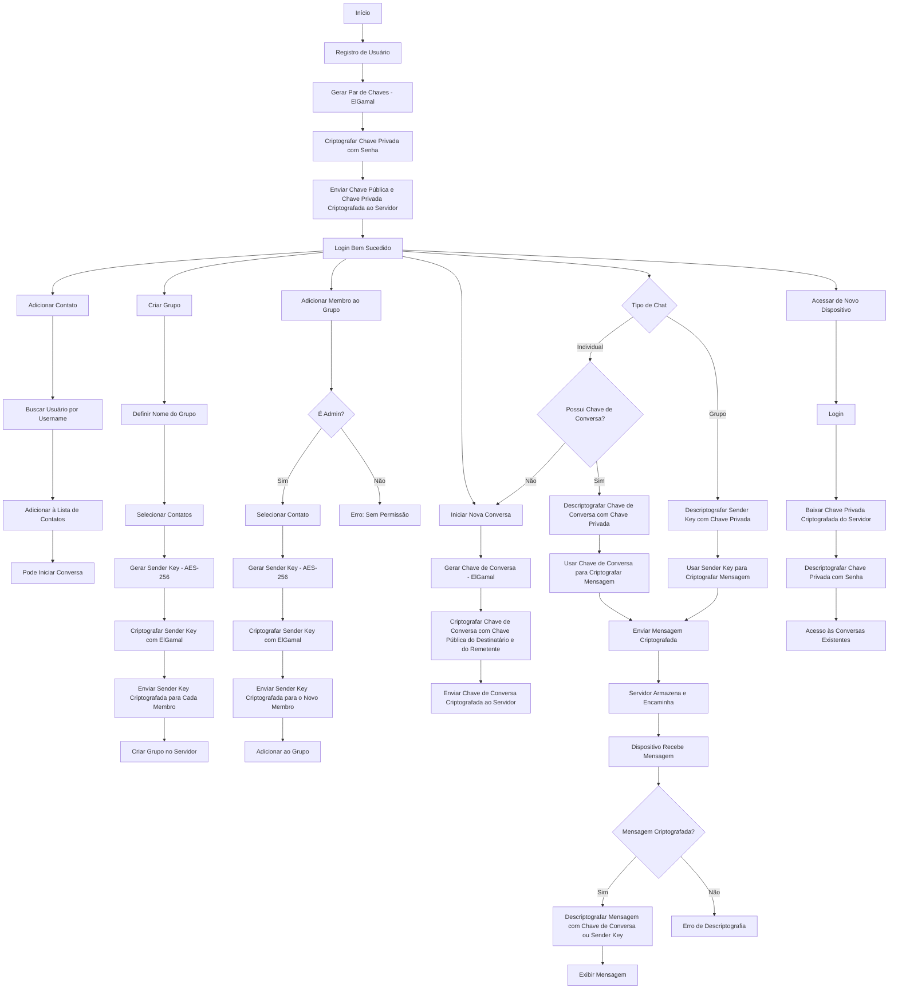

# Chat E2EE

## Visão Geral

O **Chat E2EE** é uma aplicação de mensagens com criptografia de ponta a ponta que prioriza a privacidade e segurança dos usuários. A aplicação utiliza criptografia ElGamal para garantir que apenas os usuários envolvidos nas conversas possam acessar o conteúdo das mensagens.

## Arquitetura

### Diagrama de Entidade Relacionamento


### Fluxo de Criptografia e Operações


### Componentes Principais

#### Frontend (React + TypeScript)
- Interface do usuário
- Gerenciamento de chaves e criptografia
- Comunicação via WebSocket

#### Backend (Go + Gin)
- Roteamento de mensagens criptografadas
- Gerenciamento de sessões e dispositivos
- Autenticação de usuários

#### Banco de Dados (SQLite)
- Armazenamento de mensagens criptografadas
- Chaves públicas dos usuários
- Chaves privadas criptografadas
- Metadados de conversas e grupos

### Segurança

1. **Chaves e Sessões**
   - **Chaves Privadas:** Armazenadas no servidor, mas criptografadas com base na senha do usuário utilizando ElGamal.
   - **Chaves Públicas:** Armazenadas no servidor para facilitar a criptografia das mensagens.
   - **Sessões:** As chaves de conversa são criptografadas com as chaves públicas tanto dos remetentes quanto dos destinatários utilizando ElGamal, garantindo que apenas os participantes possam acessar o conteúdo das mensagens.

2. **Criptografia**
   - **Chaves de Conversa:** Utilizam ElGamal para criptografar as chaves com as chaves públicas dos remetentes e destinatários.
   - **Sender Keys:** Utilizam ElGamal para criptografar as chaves de envio em grupos, garantindo que apenas os membros autorizados possam descriptografá-las.
   - **Chave Privada:** Criptografada com uma chave derivada da senha do usuário, garantindo que apenas o usuário possa descriptografá-la.

3. **Criptografia das Mensagens**
   - **Algoritmo Utilizado:** AES-256 em modo Galois/Counter (GCM).
   - **Processo de Criptografia:**
     1. **Geração da Chave Simétrica:** Utiliza-se a chave de conversa (para chats individuais) ou a sender key (para grupos), que são previamente criptografadas com ElGamal e descriptografadas pelo destinatário.
     2. **Criptografia da Mensagem:** A mensagem é criptografada utilizando AES-256-GCM com a chave simétrica, garantindo confidencialidade e integridade.
   - **Descriptografia no Destinatário:**
     1. **Obtenção da Chave Simétrica:** O destinatário descriptografa a chave de conversa ou sender key usando sua chave privada.
     2. **Descriptografia da Mensagem:** Utiliza-se a chave simétrica para descriptografar o conteúdo da mensagem, assegurando que somente o destinatário possa ler a mensagem original.

4. **Acesso de Novo Dispositivo**
   - **Login Seguro:** O usuário pode acessar a aplicação de novos dispositivos realizando login e descriptografando sua chave privada com a senha.
   - **Acesso às Chaves de Conversa e Sender Keys:** Com a chave privada disponível, o usuário pode descriptografar as chaves de conversa e Sender Keys armazenadas no servidor, permitindo o acesso contínuo às conversas existentes.

5. **Armazenamento no Servidor**
   - **Chaves Privadas:** Armazenadas de forma criptografada utilizando ElGamal, protegidas pela senha do usuário.
   - **Chaves Públicas e Chaves de Conversa:** Armazenadas no servidor sem criptografia adicional, já que são utilizadas para criptografar mensagens direcionadas.

6. **Gerenciamento de Grupos**
   - **Sender Keys:** Cada grupo possui uma Sender Key única, gerada com AES-256 e criptografada com ElGamal para cada membro do grupo.
   - **Adição de Membros:** Ao adicionar um novo membro a um grupo, a Sender Key é criptografada com a chave pública do novo membro utilizando ElGamal e enviada para ele.

7. **Integridade e Autenticidade**
   - **Assinaturas Digitais:** Todas as mensagens são assinadas digitalmente utilizando as chaves privadas dos remetentes, garantindo a autenticidade e integridade das mensagens.
   - **Verificação de Assinaturas:** O destinatário verifica a assinatura utilizando a chave pública do remetente antes de descriptografar o conteúdo da mensagem.

8. **Proteção Contra Ataques**
   - **Replay Attacks:** Implementação de mecanismos para detectar e prevenir a repetição de mensagens.
   - **Man-in-the-Middle:** Utilização de ElGamal para garantir que apenas os destinatários previstos possam descriptografar as mensagens, prevenindo interceptações não autorizadas.
   - **Força Bruta:** As chaves utilizadas (ElGamal e AES-256) são escolhidas por sua robustez contra ataques de força bruta.

9. **Backup e Recuperação**
   - **Chaves Privadas:** O backup é feito no servidor de forma criptografada com ElGamal, permitindo a recuperação em caso de perda do dispositivo.
   - **Chaves de Conversa e Sender Keys:** Armazenadas no servidor de forma criptografada, garantindo que possam ser recuperadas e descriptografadas em novos dispositivos após o login.

## Instalação

### Pré-requisitos
- Go 1.16+
- Node.js e npm
- SQLite

### Backend
```bash
git clone https://github.com/gugarauj07/chat-e2ee.git
cd chat-e2ee/server
go mod tidy
go run main.go
```

### Frontend
```bash
cd ../frontend
npm install
npm start
```

## Licença

MIT License - veja o arquivo [LICENSE](LICENSE) para detalhes.
